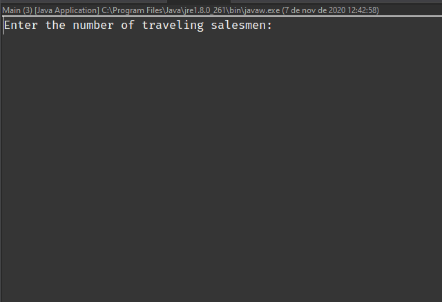

# Traveling salesman problem using simulated annealing
> Implementation of the traveling salesman problem using the Traveling salesman problem using simulated annealing heuristics to generate a solution. Developed for the discipline Artificial Intelligence at the Federal University of Ceará.

<br/>

## Getting started

```bash
# 1. Clone the repository.
git clone https://github.com/estevam96/Traveling-Salesman-Simulated-Annealing.git

# 2. open in your favorite IDE

# 3 run project
```
## Run Project
When executing the project in your favorite IDE, the program will ask for the amount of traveling salesperson you want to use ( **the option is limited between 1 and 3 travelers** ). Then just inform the amount of cities that travelers can visit (**limited between 30 and 100**). The program shows the route that each traveler will follow.




## If you want to change the cities
Inside the src folder there are two files: ncit30.bat and ncit100.bat, these files are the list of cities with the X and Y location for the algorithm to calculate the Euclidean distance between the cities